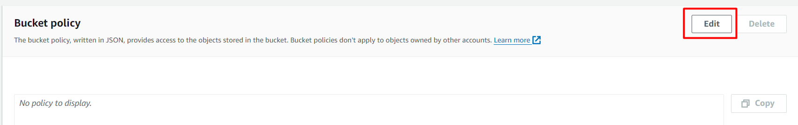

# CI/CD Amazon Web Services: Create a Pipeline to Deploy Code Automatically After a Push on GitHub

testaws

In this tutorial, we're going to create a pipeline that will help us update our static website every time we push to our local repository. This is a good practice of CI/CD, which helps to deploy very quickly.

Step 1

In this first step, we need to create an S3 bucket to store our static website (it's just a simple "Hello World" HTML file). To do this, choose the S3 service first.

Step 2

Create a bucket.

Step 3

Choose a bucket name and type.

Step 4

Here, you decide who can access your bucket and its contents. In this case, you're hosting a website, so visitors will need access to the files. Therefore, uncheck "Block all public access." If the data you store is confidential, it's better to block all public access. In this example, we didn't do that because we're making a website.

Step 5

Click on "Create bucket."

Step 6

Now you can upload the code source of your application (you can also do it by drag and drop). Go to properties.

Step 7

Now, we must specify that our bucket is to host a static website. Go to properties, enable "Static website hosting," and choose "Host a static website." Choose a name for your default file and a name for the file that will appear in case of an error.

Step 8

Let's go to "Permissions" now.

Step 9

We're going to edit the bucket policy. Click on "Policy"

Step 10

Click on "Policy generator."

Step 11

You're now in the policy editing zone. Copy the bucket ARN.

Step 12

You'll see a new console. Select the type "S3 Bucket policy." In "Add statement," select "Effect": "Allow" and "Principal": "*". In "Action," select "GetObject."

Step 13

For "Amazon Resource Name," paste the ARN you copied.

Step 14

Click on "Add Statement."

Step 15

Now click on "Generate Policy"

Step 16

Now you'll see a JSON code with configuration. Copy all this code.

Step 17

Paste the code into the "Edit bucket policy" zone of step 11. We must modify the code a little bit: add a "/*" to the end of the value of "Resource," as you can see in the image under this text.

Step 18

Click on "Save changes"

Step 19

Great, now we've finished configuring our S3 bucket. We'll now use the "CodePipeline" service to create our pipeline that will help us update our source code automatically. Go and search for the "CodePipeline" service and click on it.

Step 20

Create a pipeline.

Step 21

Choose a name for your pipeline.

Step 22

For the source provider, choose GitHub and click on "Connect to GitHub." Afterward, you'll be prompted to log in to your GitHub account and choose the repository for your project. For "Change detection options," select "GitHub webhooks (recommended)."

Step 23

You can skip the build stage because our website doesn't need to be built; it's just HTML code. If we used React.js, for example, we would have been required to build the code. In our case, we can skip this step.

Step 24

Click on "Create pipeline."

Step 25

You can now see the configuration of our pipeline.

Step 26

If you go back to S3 properties, you'll see the link to your website, and we can test it. You can now modify your code and do a commit. Once you push, your website will be updated automatically.
